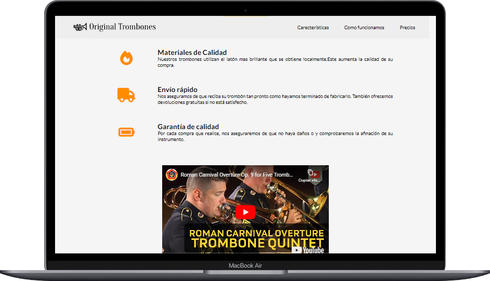

# Proyecto Trombones Originales

Este proyecto es una tienda en línea especializada en trombones de alta calidad. El proyecto utiliza tecnologías web modernas para garantizar un rendimiento óptimo y proporcionar una experiencia de usuario excepcional.

## Tabla de Contenidos

- [Proyecto Trombones Originales](#proyecto-trombones-originales)
  - [Tabla de Contenidos](#tabla-de-contenidos)
  - [Descripción](#descripción)
  - [Capturas de Pantalla](#capturas-de-pantalla)
  - [Demo en Vivo](#demo-en-vivo)
  - [Tecnologías Utilizadas](#tecnologías-utilizadas)
  - [Instalación](#instalación)
  - [Configuración](#configuración)
  - [Uso](#uso)
  - [Características](#características)
  - [Contribución](#contribución)

## Descripción

Trombones Originales representa una plataforma de comercio electrónico especializada en la comercialización de trombones artesanales de alta gama. Este proyecto es una aplicación web diseñada meticulosamente utilizando las tecnologías fundamentales de la web: HTML y CSS.

## Capturas de Pantalla

    

## Demo en Vivo

Puedes explorar el proyecto en vivo visitando [nuestra página de demostración](https://kevinrivera1.github.io/WEB-TROMBONES/).

## Tecnologías Utilizadas

El proyecto hace uso de las siguientes tecnologías:

- HTML5
- CSS3
- Font Awesome para iconos

## Instalación

Para ejecutar el proyecto localmente, sigue estos pasos:

1. Clona el repositorio: `git clone https://github.com/KevinRivera1/WEB-TROMBONES.git`
2. Abre `index.html` en tu navegador.

## Configuración

Si deseas personalizar el proyecto, puedes modificar los archivos CSS y Html según tus necesidades. Asegúrate de seguir las mejores prácticas de desarrollo web.

## Uso

Describe cómo los desarrolladores pueden utilizar el proyecto en sus propias aplicaciones o entornos.

## Características

Algunas de las características notables del proyecto incluyen:

- Materiales de alta calidad en la fabricación de trombones.
- Envío rápido y seguro.
- Garantía de calidad en cada compra.
- Trombones disponibles en diferentes modelos.

## Contribución

¡Apreciamos las contribuciones de la comunidad! Si deseas contribuir al proyecto, sigue estos pasos:

1. Crea un fork del repositorio.
2. Realiza tus cambios en una rama (branch) separada.
3. Envía una solicitud de extracción (pull request) con una descripción detallada de tus cambios.

---
